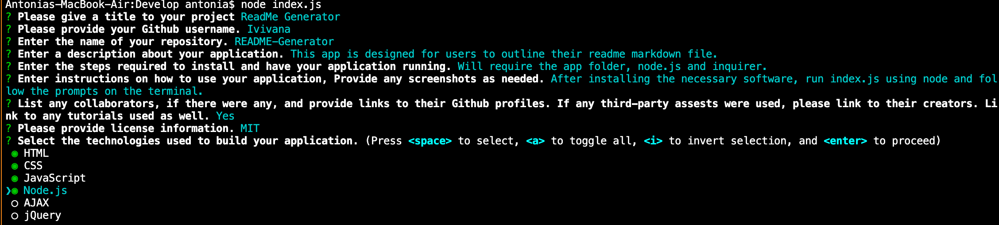

 
  <h1>ReadMe Generator</h1>

  ## Description
  This application helps users create their README.md file by asking a series of questions that will outline the requirements of a good README. By answering the prompted questions, the user will, when finished, have a README file that will be presentable for others to read to understand their project.

  ## User Story

  ```
  AS A developer
  I WANT a README generator
  SO THAT I can quickly create a professional README for a new project
  ```

  ## Table of Contents
  * [Description](#description)

  * [Installation](#installation)

  * [Usage](#usage)

  * [Credits](#credit)
  
  * [License](#license)

  ## Installation
  To install and use this application, the Node Challenge folder will be necessary along with [node.js](https://nodejs.org/en/) and [inquirer](https://www.npmjs.com/package/inquirer). The node challenge folder can be obtained from my GitHub repository [Iviviana](https://github.com/Iviviana/README-Generator).

  ## Usage
  To use this application, the user must run the index.js file using node.js. The user will then be prompted by a series of questions that must be answered.

  

  ## Credits
  Third-party assests used were node.js and inquirer. Our class TA Tuan also helped me figure out how to make the file function work.

  ## License
   <br />
  This application is covered by the MIT license.


